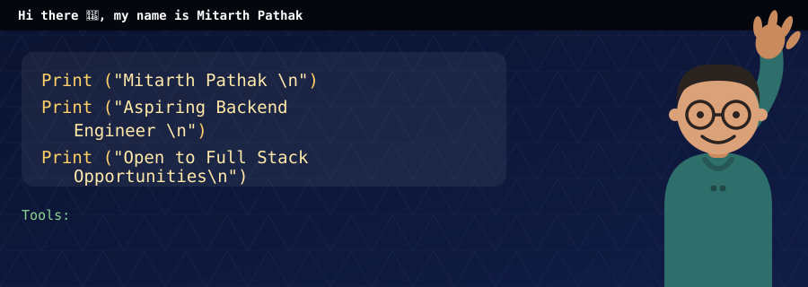
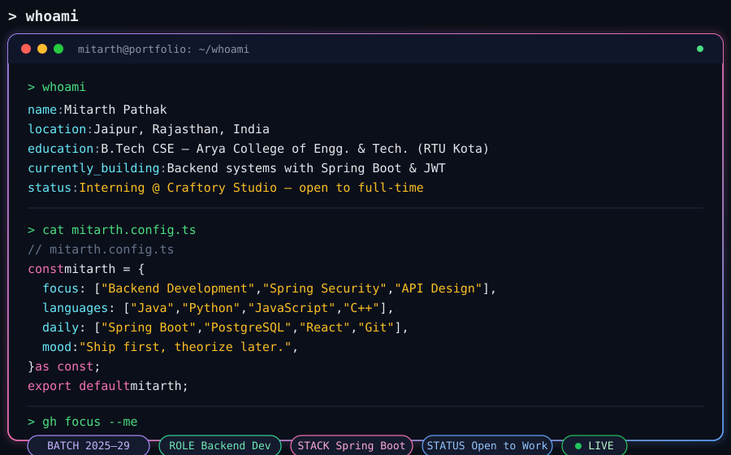
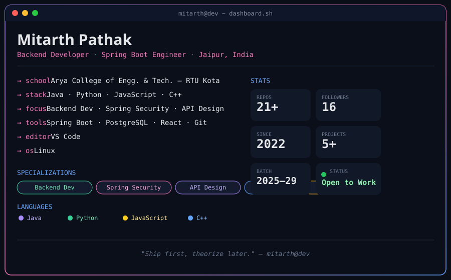

 

  

## 🚀 whoami

 

<table>
<tr>
<td width="60%" valign="top">

Currently working as a **Backend Developer (Spring Boot)** — still learning, still shipping. Comfortable with back-end design and Spring Boot fundamentals.

Intern at **Craftory Studio**, a Jaipur-based creative/digital growth startup, as a **Web Developer** — engaging with clients on the tech side. Still actively hunting for a **full-time role**, so if you're hiring, let's talk 👇

</td>
<td width="40%" valign="center" align="center">

  

</td>
</tr>
</table>

## 📈 Dashboard

## 💼 Experience

<table>
<tr>
<th>Role</th>
<th>Company</th>
<th>Duration</th>
<th>Location</th>
</tr>
<tr>
<td>🌐 <b>Web Developer</b></td>
<td>Craftory Studio</td>
<td>Ongoing</td>
<td>Jaipur, India · Remote</td>
</tr>
<tr>
<td>📊 <b>Big Data Analyst (Intern)</b></td>
<td>IBM</td>
<td>Jun 2026 - Aug 2026 · 3 mos</td>
<td>Jaipur, India · Remote</td>
</tr>
</table>

Completed the **IBM Big Data Analyst internship**, earning a completion certificate with a focus on **Large-scale Data Processing** and **Large-scale Data Analysis**.

## 👾 Contribution Pac-Man

<picture>
    <source media="(prefers-color-scheme: dark)" srcset="https://raw.githubusercontent.com/mitarthpathak/mitarthpathak/output/pacman-contribution-graph-dark.svg">
    <source media="(prefers-color-scheme: light)" srcset="https://raw.githubusercontent.com/mitarthpathak/mitarthpathak/output/pacman-contribution-graph.svg">
    
</picture>

